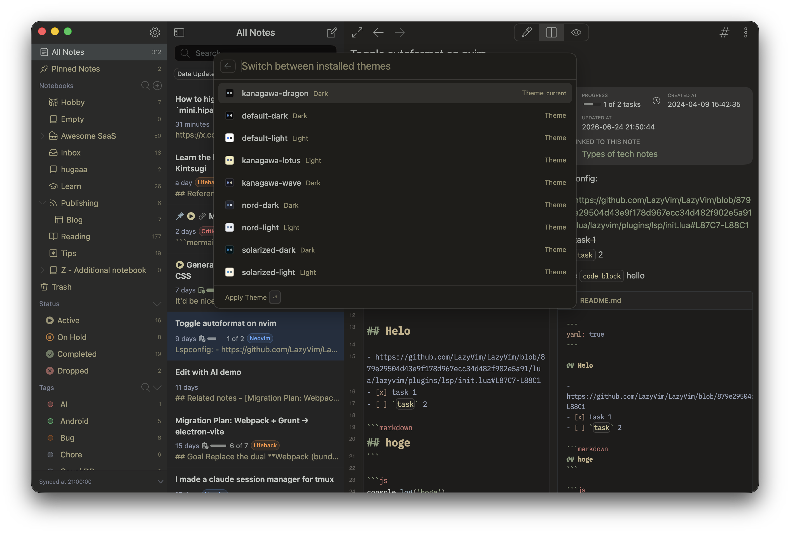

# telescope-themes

Switch between installed themes right from [Telescope](https://docs.inkdrop.app), Inkdrop's fuzzy finder — plus a one-keystroke light/dark toggle.



## Features

- **Theme source for Telescope** — fuzzy-find any installed theme and apply it instantly. Each item shows a color swatch rendered from the theme's palette and whether it's a light or dark theme.
- **Light/dark toggle** — jump between your preferred light and dark themes with a single command. The plugin remembers the last theme you used for each appearance.

## How to install

```sh
ipm install telescope-themes
```

## How to use

| Command                              | Default keybinding                                           | Description                                        |
| ------------------------------------ | ------------------------------------------------------------ | -------------------------------------------------- |
| `telescope-themes:show`              | <kbd>Ctrl</kbd>+<kbd>Alt</kbd>+<kbd>T</kbd>                  | Open Telescope scoped to the theme list            |
| `telescope-themes:toggle-light-dark` | <kbd>Ctrl</kbd>+<kbd>Alt</kbd>+<kbd>Shift</kbd>+<kbd>T</kbd> | Toggle between your preferred light and dark theme |

You can also reach the theme list from the regular Telescope bar with the `h` prefix, or via **Plugins → Themes** in the menu.

### Preferred light/dark themes

The toggle command switches between the themes set in the plugin's `lightTheme` and `darkTheme` settings (defaults: `default-light` / `default-dark`). Whenever you apply a theme — via the picker or the toggle — it's remembered as the preferred theme for its appearance, so toggling back restores it.

## Development

```sh
pnpm install
pnpm dev        # rebuild on change
pnpm build      # production build into lib/
pnpm lint       # lint with oxlint
pnpm format     # format with oxfmt
pnpm typecheck  # type-check with tsc
ipm link        # symlink into your Inkdrop data dir for local testing
```
